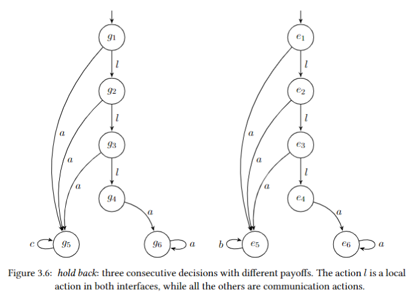

# Control Synthesis for Concurrent Systems using Deep Reinforcement Learning - Dual Interface Version 
## Overview 
We look at the problem of optimizing the interaction between different concurrent components of a distributed system.
In particular, we look at the case where two interfaces do not know the internal structure of each other, hence considering each other as a black box. This can be generalized to multiple components that need to cooperate
on a mutual task where each component is designed autonomously.
We aim to minimize the number of failures of offered interactions between the interfaces.
This version of our prototype tool controls the communication between two interfaces, where each one of them perceives 
the other as a black box environment. We designed examples that capture various potential control difficulties for 
this setting.
We started with a two components setting, where their goal was to synthesize two separate controls, such that the 
number of failures is minimal. Later on, we enriched each component's functionality by adding a new type of action - 
local actions. Local actions can be triggered independently and affects only the triggering interface.

## Example
Consider the following dual interface example with a combination of local actions and communication actions.
This example is called the "hold back" experiment. The action "l" is a local action in both interfaces, while all the
others are communication actions. The reward for local actions was set to 0.5, and the reward for a successful 
communication actions was set to 1. A reward of 0 was given for a missed communication action, while a failed 
communication action had a reward of -1.

In this example, both interfaces are faced with three consecutive decisions, where they have to choose between 
two options with different payoffs. The optimal result for them may be achieved only if they both choose the least 
rewarding course of action at every decision point. In this experiment we did not consider the failure rate, 
but the average cumulative rewards throughout the execution. 

## Requirements
- Python 3.6 or above
- PyTorch package
- NumPy package

## Available Experiments
Our prototype comes with eight built-in examples. Each examples consists of a pair of interfaces.

| Experiment             | Best Possible  Failure Rate (%) |
|------------------------|-------------------------------------|
| Dual-Permitted         | 0                                   |
| Dual-Schedule          | 0                                   |
| Dual-Cases             | 50.25                               |
| Dual-Choice-SCC        | 1.5                                 |
| Dual-Schedule-cycle    | 0                                   |
| Dual-Cycle-SCC         | 1.5                                 |
| Dual-ABCD-Coordination | 0                                   |
| Hold-Back              | 0                                   |

Failure percentages are per episodes with 200 timesteps.

## Adding New Experiments
To add a new system & environment pair, follow these steps:
- Add a new function to `experiment.py`. Use the same structure as in previous examples.
- Update the function `experiment_selector` in `ppo_experiment.py` with the label of the new experiment.

## Execution Instructions
Follow these instructions to train/evaluate the model for a certain example.

### Mandatory command line arguments
The following arguments can be used for the file `ppo_experiment.py`.

| Argument       | Details                                                                                                                                      |
|----------------|----------------------------------------------------------------------------------------------------------------------------------------------|
| `--mode`       | to train the model, use the value `train`. To evaluate it, use the value `test`.                                                             |
| `--experiment` | use one of the following values: `permitted`,`schedule`,`cases`,`choice_scc`,`schedule_cycle`,`cycle_scc`, `abcd_coordination`, `hold_back`. |

For instance, the following line would train the model with respect to the first built-in experiment:

`python3 ppo_experiment.py --mode=train --experiment=permitted`

The line below would evaluate the model ten time along 200 timesteps: 

`python3 ppo_experiment.py --mode=test --actor_model=ppo_actor`

### Optional command line arguments
The below arguments are optional; their default values are the ones that led to the optimal results. The parameters and 
their default values can be found at arguments.py.

| Argument              | Details                                                                          |
|-----------------------|----------------------------------------------------------------------------------|
| `--batch_timesteps`   | the number of allowed timesteps in each batch.                                   |
| `--episode_timesteps` | the nubmer of allowed timesteps in each episode.                                 |
| `--gamma`             | the discount factor value.                                                       |
| `--iteration_updates` | the number of iterative PPO optimization steps for each batch.                   |
| `--lr `               | learning rate.                                                                   |
| `--clip `             | PPO's clipping epsilon.                                                          |
| `--total_timesteps`   | the total number of timesteps for the entire training process.                   |
| `--init_tem `         | initial exploration temperature.                                                 |
| `--tem_decay `        | temperature decay factor.                                                        |
