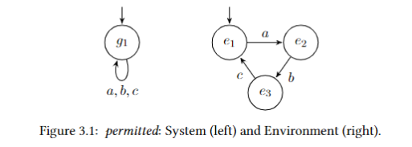

# Control Synthesis for Concurrent Systems using Deep Reinforcement Learning - Single Interface Version 
## Overview 
We look at the problem of optimizing the interaction between different concurrent components of a distributed system.
We aim to minimize the number of failures of offered interactions between the interfaces.
Here, we limit ourselves to studying the synthesis of control for a system that interacts with a black-box 
environment. An approach based on deep learning and reinforcement learning was presented in [1], suggesting training 
a Recurrent Neural Network RNN to control such a system. In this prototype tool, we present several advancements of 
this approach. 
While the previous work was based on the REINFORCE algorithm, our algorithm and implementation is based on an 
Actor-Critic approach [2]. We show an (sometimes stark) improvement of the experimental results. 
Later, we extend this took to control the communication between two interfaces, where each one of them perceives 
the other as a black box environment. We designed examples that capture various potential control difficulties for 
this extended setting.

## Example
The image below presents a system (left) and its environment (right). This system can always make a choice between 
the actions a, b and c, and the environment has to agree with that choice if it is enabled from its current state. 
Remember that the system is unaware of the environment's internal state. If the system selects actions according to 
(bca)\*, then the environment can follow that selection with no failures. On the other hand, if the system selects 
actions according to (baa)\*, the system will never progress, while the environment keeps changing states. This tool's
goal is to construct a control that restricts the system's actions at each step such that the number of failed 
interactions will be minimal.

## Requirements
- Python 3.6 or above
- PyTorch package
- NumPy package

## Available Experiments
Our prototype comes with six built-in examples, that also appeared in [1]. Each examples consists of a system and 
environment pair.

| Experiment     | # Environment  States | Best Possible  Failure Rate (%) |
|----------------|----------------------|-------------------------------------|
| Permitted      | 3                    | 0                                   |
| Schedule       | 4                    | 0                                   |
| Cases          | 5                    | 1.5                                 |
| Choice-SCC     | 25                   | 1.5                                 |
| Schedule-cycle | 4                    | 0                                   |
| Cycle-SCC      | 25                   | 1.5                                 |

Failure percentages are per episodes with 200 timesteps.

## Adding New Experiments
To add a new system & environment pair, follow these steps:
- Add a new function to `experiment.py`. Use the same structure as in previous examples.
- Update the function `experiment_selector` in `ppo_experiment.py` with the label of the new experiment.

## Execution Instructions
Follow these instructions to train/evaluate the model for a certain example.

### Mandatory command line arguments
The following arguments can be used for the file `ppo_experiment.py`.

| Argument       | Details                                                                                                      |
|----------------|--------------------------------------------------------------------------------------------------------------|
| `--mode`       | to train the model, use the value `train`. To evaluate it, use the value `test`.                             |
| `--experiment` | use one of the following values: `permitted`,`schedule`,`cases`,`choice_scc`,`schedule_cycle`,`cycle_scc`.   |

For instance, the following line would train the model with respect to the first built-in experiment:

`python3 ppo_experiment.py --mode=train --experiment=permitted`

The line below would evaluate the model ten time along 200 timesteps: 

`python3 ppo_experiment.py --mode=test --actor_model=ppo_actor.pth`

### Optional command line arguments
The below arguments are optional; their default values are the ones that led to the optimal results. The parameters and 
their default values can be found at arguments.py.

| Argument              | Details                                                                          |
|-----------------------|----------------------------------------------------------------------------------|
| `--batch_timesteps`   | the number of allowed timesteps in each batch.                                   |
| `--episode_timesteps` | the nubmer of allowed timesteps in each episode.                                 |
| `--gamma`             | the discount factor value.                                                       |
| `--iteration_updates` | the number of iterative PPO optimization steps for each batch.                   |
| `--lr `               | learning rate.                                                                   |
| `--clip `             | PPO's clipping epsilon.                                                          |
| `--total_timesteps`   | the total number of timesteps for the entire training process.                   |
| `--init_tem `         | initial exploration temperature.                                                 |
| `--tem_decay `        | temperature decay factor.                                                        |

## References
[1] S. Iosti, D. Peled, K. Aharon, S. Bensalem, and Y. Goldberg, “Synthesizing control for a
system with black box environment, based on deep learning".

[2] T. Haarnoja, A. Zhou, P. Abbeel, and S. Levine, “Soft actor-critic: Off-policy maximum
entropy deep reinforcement learning with a stochastic actor".